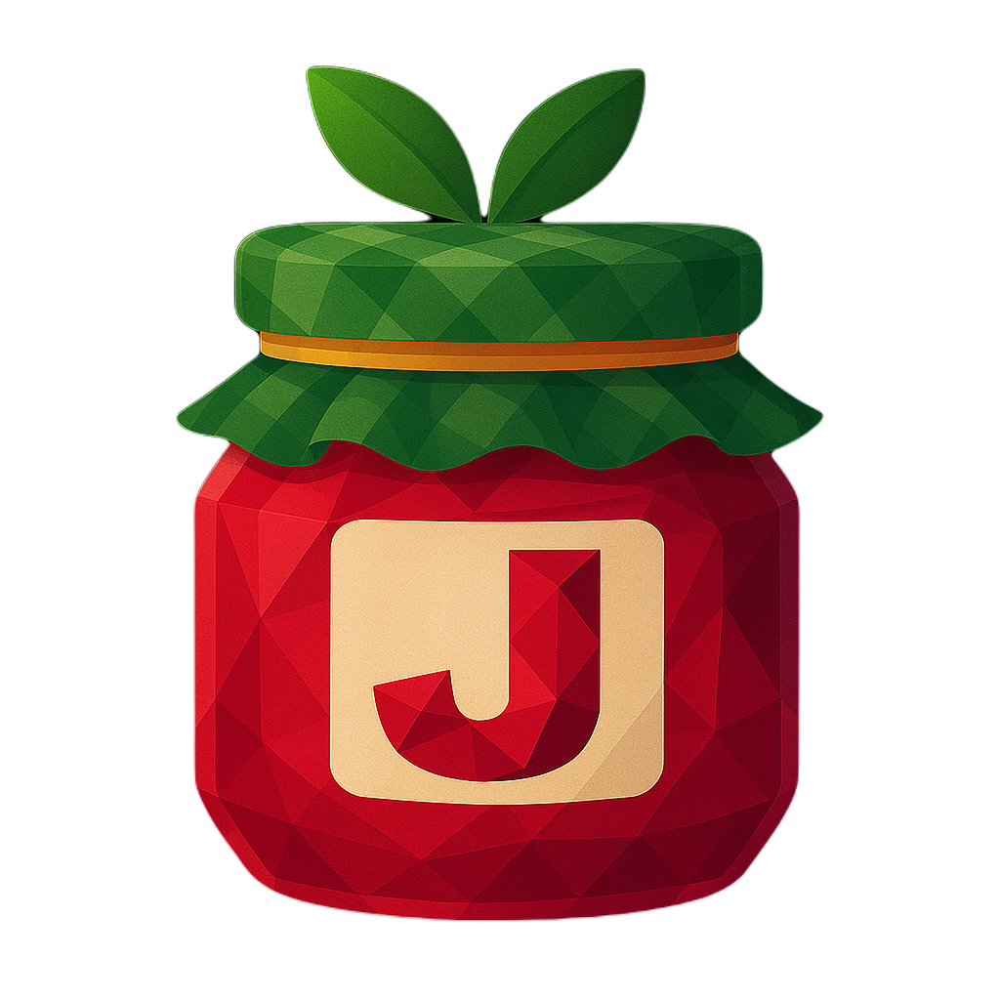

    
  

 

Jam is a modular man-in-the-middle proxy designed for [Animal Jam Classic](https://classic.animaljam.com). Built with [Node.js](https://nodejs.org) and [Electron](https://www.electronjs.org), Jam provides powerful tools and flexibility for your Animal Jam experience.

## Features

- **Modular Architecture:** Extend and customize your proxy setup with various plugins.
- **User-Friendly Interface:** Developed with Electron for a seamless desktop experience.
- **Active Development:** Regular updates and community support.

## Table of Contents
- [Installation](#installation)
  - [Windows](#windows)
  - [MacOS](#macos)
  - [Run from source](#run-from-source)

## Installation

### Windows

1. Download the latest version of [Jam-Setup.exe](https://github.com/sxip/jam/releases/latest).
2. Extract the downloaded file.
3. Run `jam.exe` to start the application.

### MacOS

1. Download the latest version of [Jam.dmg](hhttps://github.com/sxip/jam/releases/latest).
2. Mount the downloaded file.
3. Install `Jam` by moving it to the Applications folder
4. Run `sudo /Applications/Jam.app/Contents/MacOS/Jam` to start the application.

## Run from source

1. Clone the repository.
2. Install dependencies with `npm install`.
3. Run `npm run dev` to start the application.
