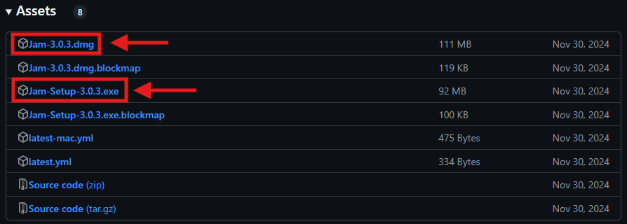
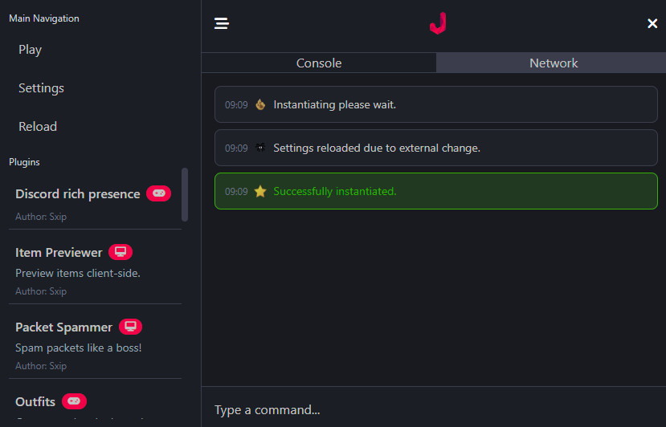
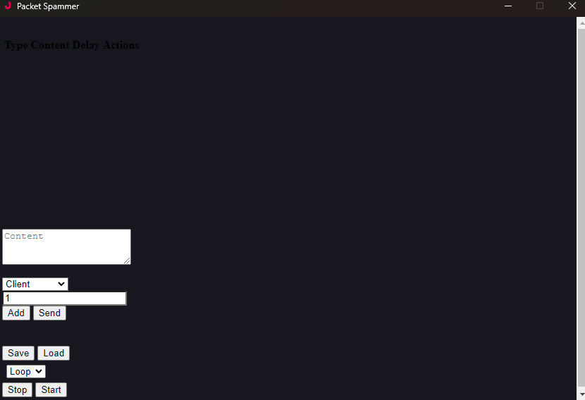
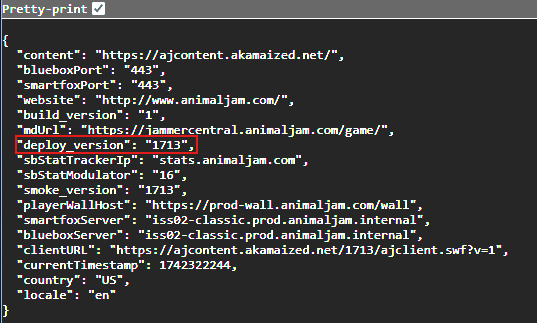
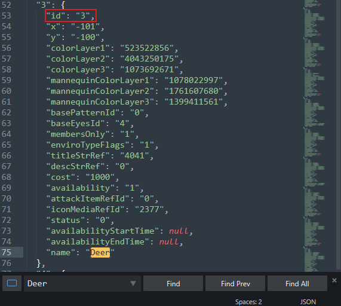

## Table of Contents

- [Installation](#installation)
- [Useage](#useage)
  - [Starting Aj / Troubleshooting](#starting-aj-classic)
  - [Commands](#commands)
  - [Networking](#networking)
- [Defpacks](#defpacks)
  - [Retrieving](#retrieving)
  - [Identifying Packet Structure](#identifying-packet-structure)

# Installation

Make sure you get the latest copy from [Releases](https://github.com/sxip/jam/releases) on the right of the page by clicking the file for your platform. Do not download a Zip from under the Code section unless you're trying to run from source.

`.dmg` should be used for MacOS, and `.exe` on Windows. Run the Installer after it is downloaded and allow changes if prompted.

**Note:** This guide won't be covering the MacOS version of Jam, but there shouldn't be too many differences unless you're troubleshooting certain issues.

# Useage

## **Starting Aj Classic**

To begin, run Jam from the shortcut that was created on the Desktop, or search for it if there is none.

 Assuming Aj Classic is already installed, press Play on the top left. A game window should appear.

---

**Q: Pressing Play does nothing, why isn't it working?**

**A:** Please refer to [this page](other/playtroubleshooting.md)

---

## **Commands**

If you're just getting familiar with Jam, there are some built in commands you can play around with if you'd like to in the Console tab. Enter them a second time to toggle them off.

---

- `achivements`
    Gives active account(s) most avalible achivements.
- `mimic`
    Copies other player's messages sent in the chat. Only works if you also type mimic in chat afterwards.
- `glow`
    Randomly changes your animal's Glow color.
- `color`
    Randomly changes your animal's colors

Not sure how outfit cycling works so won't be covering that here. Feel free to make a pr if you wan't to document more here.

## **Networking**

If you go the network tab on the top right after you've logged in, you should see a long list of text.

---

---

These are Packets. Ones highlighted in green are outgoing from your client, grey is recieving/server sided. This was taken while playing The Return of the Phantoms. Each is formatted differently depending on what's intended to be performed/communicated.

You can customize, and send your own packets by clicking on the Packet Spammer to the left of the window.

---

Enter the packet you want to send into the Content field. To understand how to customize certain aspects of your packet depending on what it's for, refer to the [DefPacks](#defpacks) section. You can also add multiple packets to a list by clicking add after you have what you want in the Content field, and run each one in order. If you'd like you can save your list setup with the save button.

Delay can be set in the second field which is autofilled with 1.

# DefPacks

DefPacks contain information about different aspects of the game for reference, like IDs, colors, etc.

## **Retrieving**

You can pull the latest from Aj's server using [Animaljam.js](https://github.com/sxip/animaljam.js), but I wont be covering how to write your own code here. You can either contact [babylard](https://github.com/babylard) on Discord for the latest defpacks, or use [this repo](https://github.com/babylard/defpacksdecoder) and replace the `deployVersion: '{number}'` with whatever is shown at [https://animaljam.com/flashvars](https://animaljam.com/flashvars) in the Deploy version field if it isn't up to date.

## **Identifying Packet Structure**

As a basic example, we're going to try and get an unavalible animal using the information we have in our DefPacks folder. First I'm going to buy an animal, doesn't matter which, while in Jam and go to the Network tab to see what packet is sent from our client after the transaction is made.

In my case I bought a Deer, and the packet I got was `%xt%o%aa%8817%15202%27120%15327%3%-1%-1%-1%` after clicking Buy.

Now if we look in the json file labeled Animals in our DefPacks, we can search for the Deer by pressing `ctrl + f` to search in your text editor.

As you can see the ID of the animal is 3, and there is also a 3 in our packet seperated by two `%` characters. So this must be where the ID is located. Replace that with whatever you like in the DefPacks as long as you have a sufficient amount of Gems/Diamonds, and send it with the packet spammer set to Animal Jam and not Client on the dropdown.

Relog, and you should have your animal.
