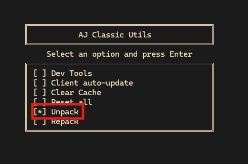

# Possible fixes

## **Repack Asar**

I've found that sometimes just unpacking and re-packing the Asar archive Aj Classic uses can fix the issue, couldn't tell you why. Download [AjcUtils](https://github.com/babylard/AjcUtils/) from releases, and run it. Accept anything if prompted. Highlight Unpack with your arrow keys, and press Enter. After it's finished, press M when prompted to return to the menu. Highlight RePack this time, and press enter. Afterwards you can close the window. Try launching Aj through Jam again and see if it fixes your issue.

## **Clear Cache**

Commonly fixes this issue. Select the Clear Cache in Ajcutils and press Enter.

If you'd like to do it manually, navigate to `C:\Users\{your username}\AppData\Roaming` in the file explorer, delete the `AJ Classic` folder, and retry. This is an auto-generated folder to store temporary information and wont cause any harm if you delete it.

You can do this to Jam as well if you want since it's also an Electron app, but it's unlikely to make any difference.

## **First Launch/Close**

If you've just installed Aj Classic, you'll have to run it and close it once so it can complete it's first update. Jam sometimes wont work unless you've done this first. Usually the least common cause of this issue.